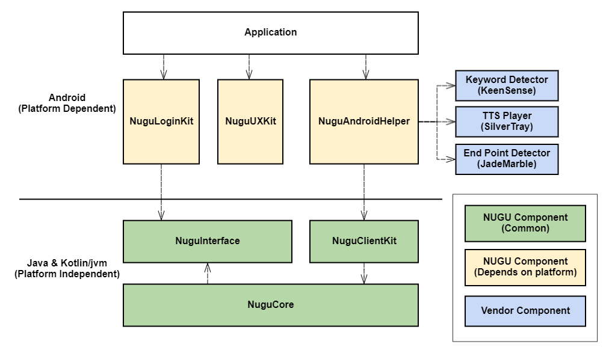

# NUGU SDK for Android
An SDK for application to integrate NUGU service at Android based on Kotlin or Java.

## Introduction to components
The SDK consist of following components. Look at diagram.
* Nugu Interface : Provide common interfaces to communicate with NUGU SDK.
* Nugu Core : This component implements core business logic for NUGU service.
* Nugu Agent : Provide default agent implementation such as ASRAgent, TTSAgent etc.
* Nugu Android Helper : Provide a default android client to help you integrate into the application simply.
* Nugu UX kit : Provide an UX components that follow NUGU's design guide.
* Nugu Login kit : Provide helpers for NUGU Login.
* Nugu Client kit :  Provide helpers to easily develop for NUGU service



## Requirements
###### Network : above TLS v1.2
###### OS : above Android 5.0 (API level 21)
###### Language : Java , Kotlin

## How to integrate into your application?
Basically, the SDK provide a flexiable way for integration.\
Only mandatory components for integration are 'Nugu Interface' and 'Nugu Core'.\
The others are utility compoenents to easy integration.\
But, we explain an simple method here.
#### Method 1 : (The most easy way) Use "Nugu Android Helper"
##### Setup dependency
At module's build.gradle
```groovy
dependencies {
	implementation 'com.skt.nugu.sdk:nugu-android-helper:$latestVersion'
}
```
##### Create Nugu Android Client
The client provides most of the APIs for status notification and control of the SDK.
```kotlin
val client = NuguAndroidClient.Builder(
        context,
        authDelegate,
        defaultAudioProvider
        ).endPointDetector(EndPointDetector(EPD_MODEL_FILE_PATH)).build()
```
##### Use SpeechRecognizerAggregator
If the application use "Keyword Detector" to wake up, recommend to use.\
Otherwise, skip this part.\
This class provides a convenient way to manage "Keyword Detector" and "SpeechProcessor" easily.\
The constructor requires three parameters. Look at documentation about details.
```kotlin
val speechRecognizerAggregator = SpeechRecognizerAggregator(
									KeensenseKeywordDetector(keywordResource), 
									SpeechProcessorDelegate(client?.asrAgent), 
									audioSourceManager)
```
